```{r,echo=FALSE, message=FALSE,warning=FALSE}
knitr::opts_chunk$set(cache=TRUE)

#library(devtools)
#devtools::install_github("CSAFE-ISU/bulletr")
library(bulletr)
library(ggplot2)
library(knitr)

```

## Methods for Automatic Groove Identification <br> in 3D Bullet Land Scans { .white }

<br><br><br><br><br><br><br>
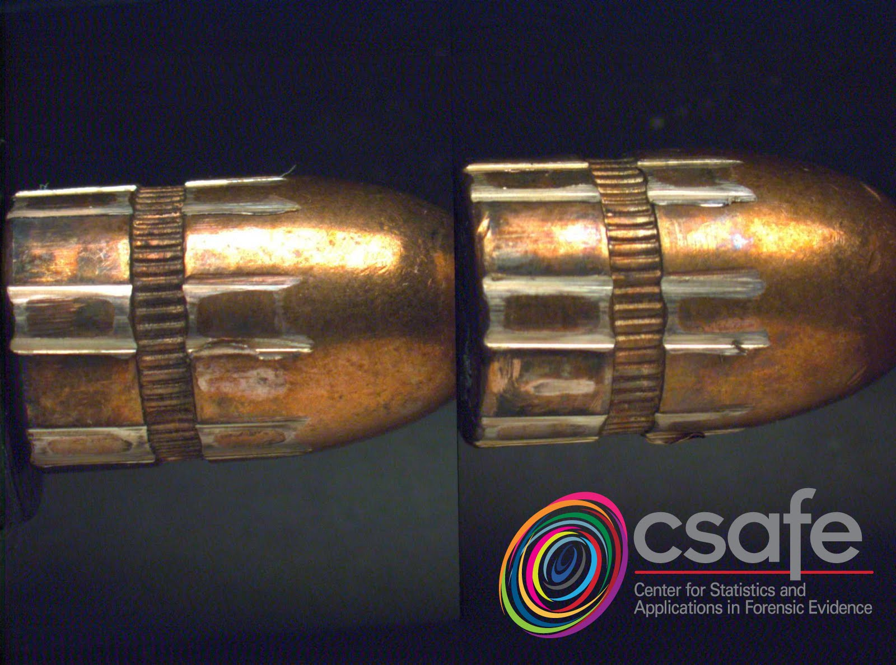
<p class="white">
Kiegan Rice <br />
Iowa State University<br />
August 2nd, 2018
</p> 


## Background: Statistics Applied to Forensic Science  


- Validity of forensic evidence analysis has come under fire in the last decade  
- 2016 PCAST report on feature-comparison methods  
- NIST Center of Excellence established in 2016  


## Background: Bullet Lands


- When a gun is fired, the bullet is propelled forward through the barrel  
- As it travels down the barrel, it makes contact with parts of the barrel  
- Striations result from this contact   
- Striations are observed on land engraved areas (*lands*). Lands are separated by groove engraved areas (*grooves*).  

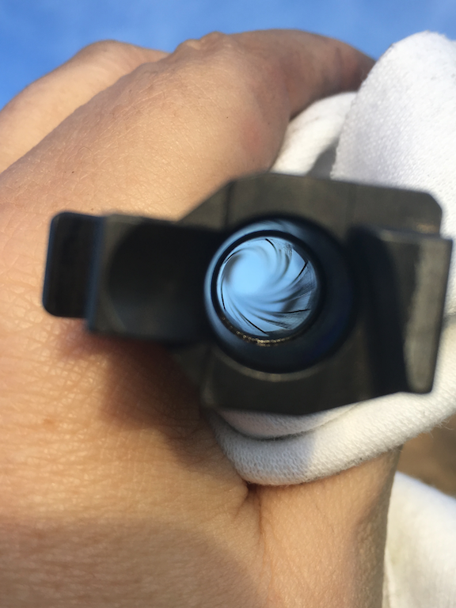 &nbsp;
 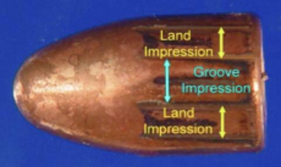 


## Background: Collection of Land Data  


- Sensofar Confocal Light Microscope  
- Hamby set 44 - 35 bullets from 10 consecutively rifled Ruger barrels
    - Rescanned with CSAFE's microscope  
    - To use as 'base' set; methods to be tested on several other data sets
    - Have manual groove identifications for this whole set  
    - Each pixel: .645 square microns
    - Each land is 2mm (2000 microns) wide
- A scan of one bullet (6 individual lands) takes ~1 hour  


## Background: Land Surface  


```{r, echo = F, warning = F, message = F}
#bulletr::plot_3d_land(bullet = br411, sample = 2)
br411_fort <- fortify_x3p(br411)
br411_sample <- sample_x3p(br411_fort, byxy = c(2,2))
br411_new <- bulletr::unfortify_x3p(br411_sample)

bulletr::plot_3d_land(bullet = br411_new)
```


## Background: Importance of Groove Removal  


- Bullet matching algorithm  
- Removing the underlying curved structure of land 
- Looking at remaining residuals 
    - Deviations from the natural curve of the land  
    
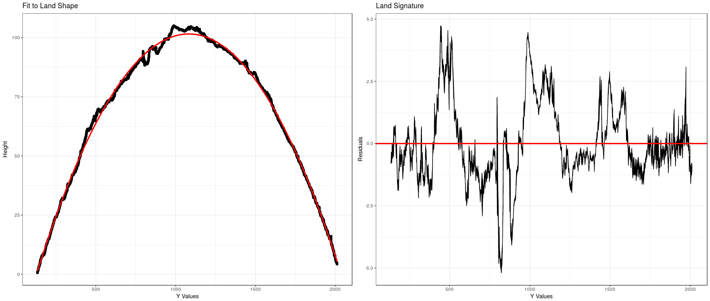


## Background: Importance of Groove Removal  


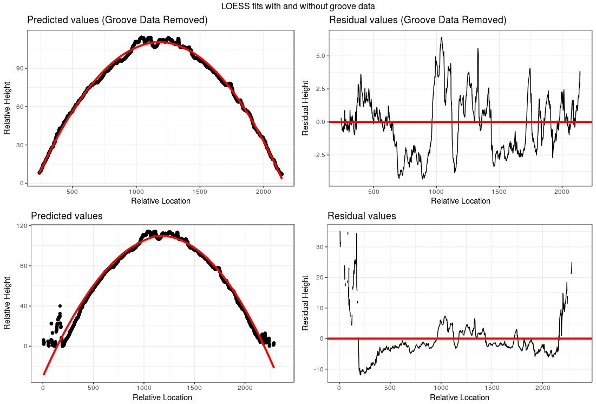  


## Robust LOESS   


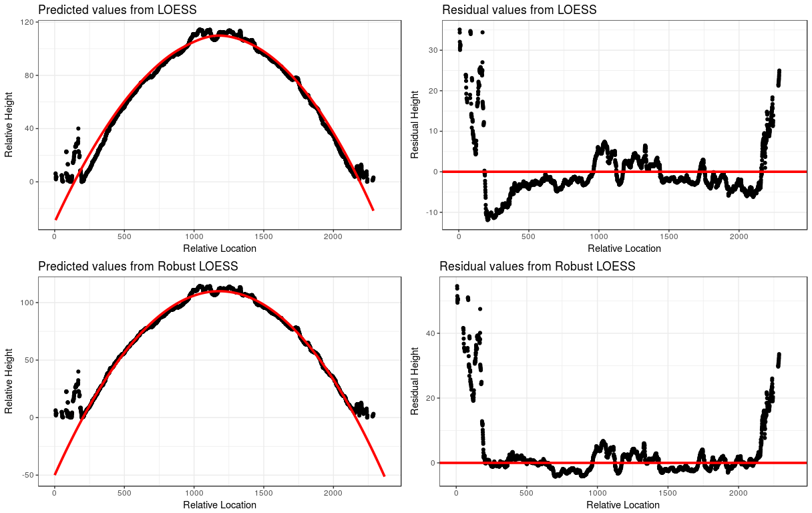  


## Groove Identification Process  


- Once we have the residuals, how do we decide where the cutoffs should be?  
- Ad hoc approach: define a cutoff 
    - 2*MAR (median absolute residual)
    
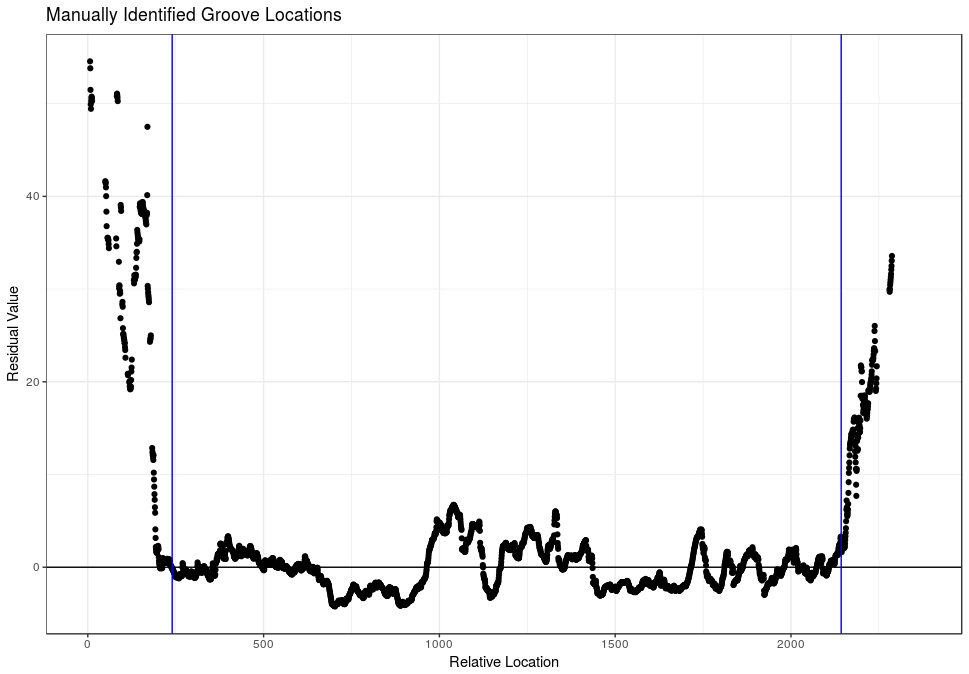


## Comparing approaches 


- Difficult to determine a metric for accuracy  
    - Number incorrectly identified doesn't work  
- We will look at all the residuals in the areas between our predicted grooves and the manually identified grooves  
- For each land in the data set (208 total), sum up these residuals  

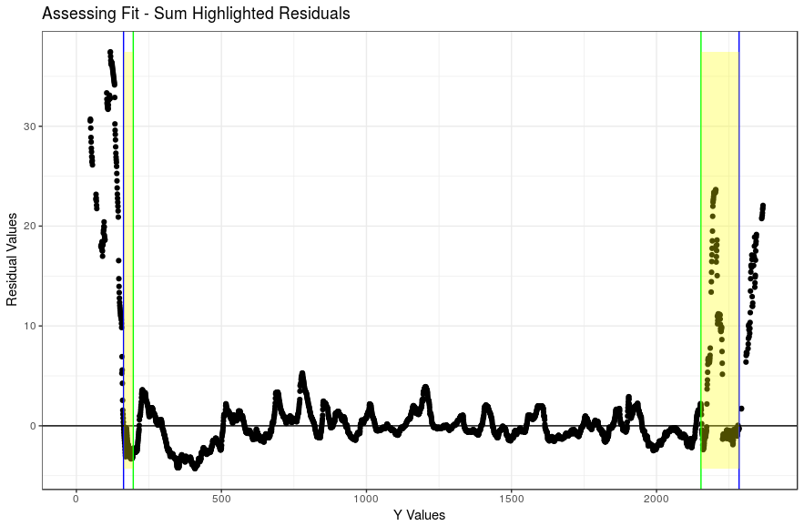

## Comparing approaches   


- The sums shown previously are calculated for each land and each method 
- Then, we compare the distributions of those values

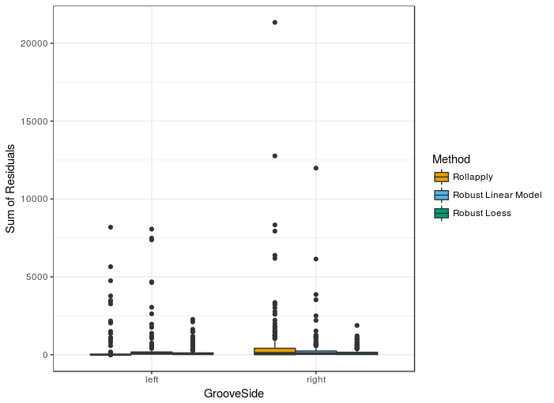 &nbsp;
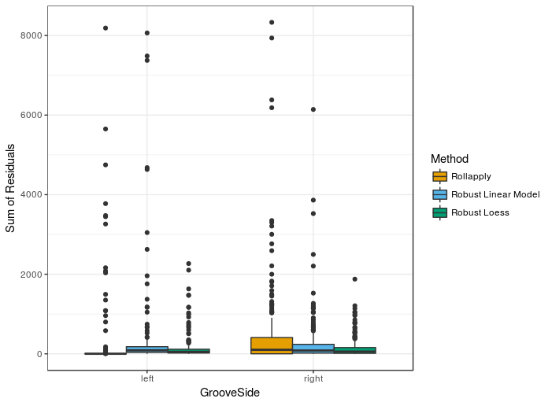


## Next steps  


- Moving away from ad hoc cut-off value  
- Two-class classification procedures for individual points within the data  
    - Using residuals as predictor in model  
    - Unbalanced response 
    
    
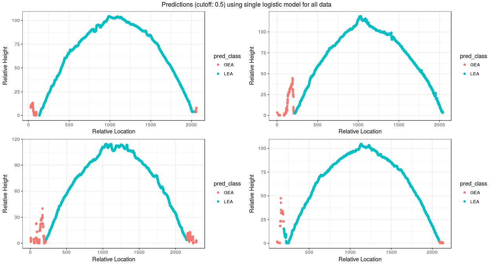


## Acknowledgments  


- All work was **sponsored** by CSAFE (Center for Statistics and Applications in Forensic Evidence), a NIST Center of Excellence  
- Work **advised** by Drs. Heike Hofmann and Ulrike Genschel of CSAFE/Iowa State University


