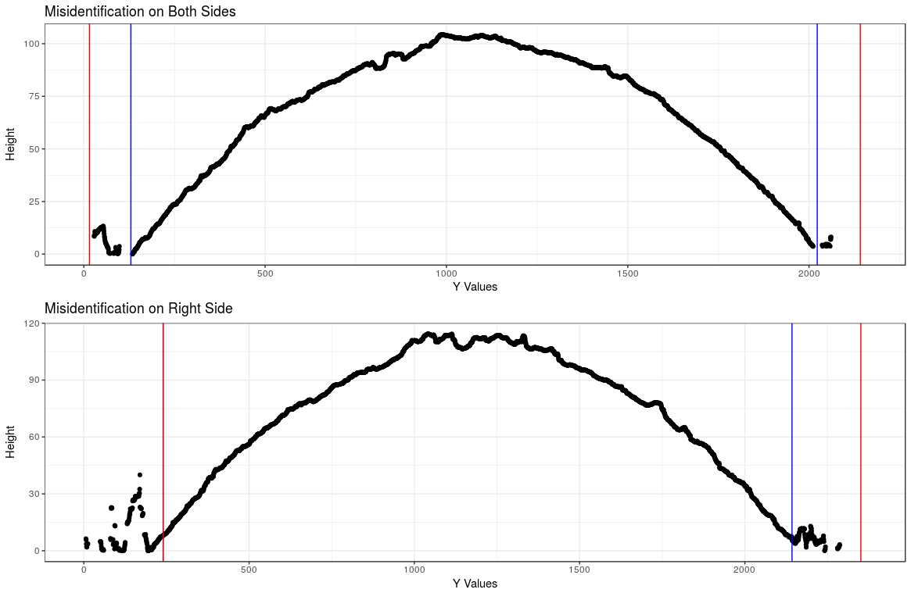
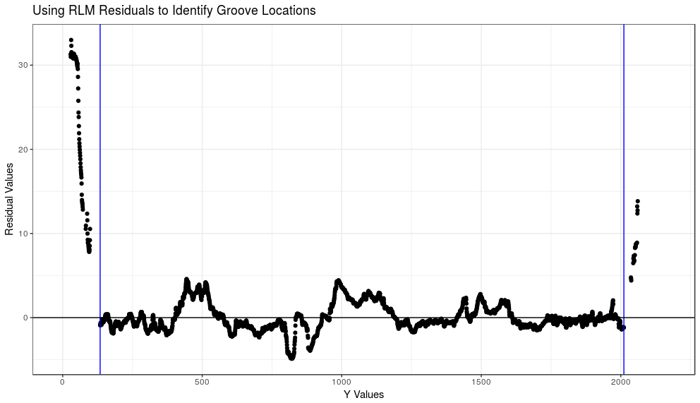
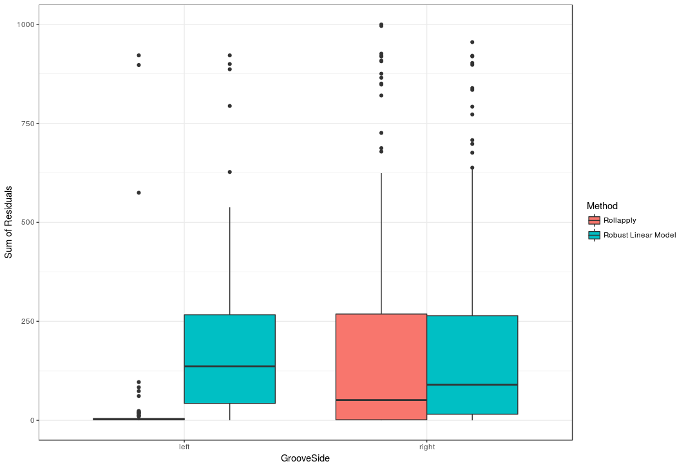
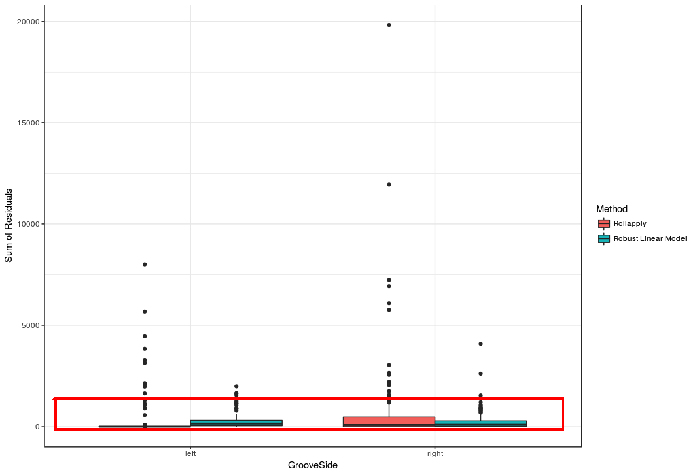

```{r,echo=FALSE, message=FALSE,warning=FALSE}
knitr::opts_chunk$set(cache=TRUE)

#library(devtools)
#devtools::install_github("CSAFE-ISU/bulletr")
library(bulletr)
library(ggplot2)
library(knitr)
```

## Methods for Automatic Groove Identification <br> in 3D Bullet Land Scans { .white }

<br><br><br><br><br><br><br>

<p class="white">
Kiegan Rice <br />
Iowa State University<br />
August 2nd, 2018
</p> 


## Background: Statistics Applied to Forensic Science  


- Validity of forensic evidence analysis has come under fire in the last decade  
- 2016 PCAST report on feature-comparison methods  
- NIST Center of Excellence established in 2016  


## Background: Bullet Lands


- When a gun is fired, the bullet is propelled forward through the barrel  
- As it travels down the barrel, it makes contact with parts of the barrel  
- Striations result from this contact   
- Striations are observed on land engraved areas (*lands*). Lands are separated by groove engraved areas (*grooves*).  

 &nbsp;
  


## Background: Collection of Land Data  


- Sensofar Confocal Light Microscope  
- Hamby set 44 - 35 bullets from 10 consecutively rifled Ruger barrels
    - Rescanned with CSAFE's microscope  
    - To use as 'base' set; methods to be tested on several other data sets
    - Have manual groove identifications for this whole set  
    - Each pixel: .645 square microns
    - Each land is 2mm (2000 microns) wide
- A scan of one bullet (6 individual lands) takes ~1 hour  


## Background: Land Surface  


```{r, echo = F, warning = F, message = F}
#bulletr::plot_3d_land(bullet = br411, sample = 2)
bulletr::plot_3d_land(bullet = br411)
```


## Background: Importance of Groove Removal  


- Bullet matching algorithm  
- Removing the underlying curved structure of land 
- Looking at remaining residuals 
    - Deviations from the natural curve of the land  
    


## Background: Importance of Groove Removal  


- Error Rates  
    - Traditional rifling and manual identification of grooves  
        - Bullet-to-bullet matching error rate is 0.
    - Polygonal rifling and coated bullets 
        - Error rate is higher  
    - **Biggest error source: misidentification of groove locations**  


## Shortcomings of Current Methods




## Robust LOESS   


  


## Groove Identification Process  


- Once we have the residuals, how do we decide where the cutoffs should be?  



## Comparing two automated approaches 


- We will look at all the residuals in the areas between our predicted grooves and the manually identified grooves  
- For each land in the data set (208 total), sum up these residuals  


## Comparing two automated approaches   


- The sums shown previously are calculated for each land and each method 
- Then, we compare the distributions of those values

 &nbsp;



## Impact for Forensic Analysts


- Currently: Individual case studies  
- Collaborations with different police depts. and forensic institutes
    - Phoenix PD, Los Angeles PD, St. Louis PD, Denver PD  
    - Story County Sheriff's Office (IA)
    - Houston Forensic Science Center  

## Impact for Forensic Analysts


- Future goals: 
    - Get algorithm certified 
        - no certification process in place for admissibility  
    - Adhere to OSAC's updated standards for 3D measurements (Feb. 9, 2018)  
    - Support firearms examiners in their job
    - Address concerns raised by NRC 2009 and PCAST 2016 
        - removing subjectivity from the assessment 
        - allow for quantification of error rates


## Acknowledgments  


- All work was **sponsored** by CSAFE (Center for Statistics and Applications in Forensic Evidence), a NIST Center of Excellence  
- Work **advised** by Drs. Heike Hofmann and Ulrike Genschel of CSAFE/Iowa State University


