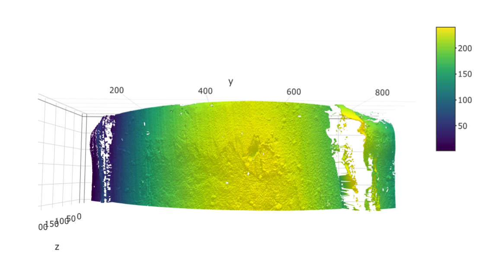
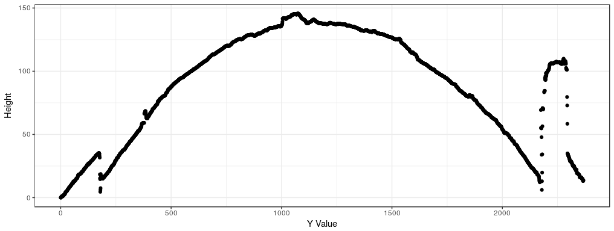

\section{Background}  

Historically, forensic firearms examiners have analyzed bullet striations through a process of visual feature comparison. Examiners compare striation marks impressed on the lands of a bullet between a bullet fired from a known barrel to a questioned bullet to investigate whether the two bullets were propelled through the same gun barrel.  

These visual analyses, based on the concept of Quantitative Consecutively Matching Striae (QCMS), are one of several feature comparison methods whose scientific foundations were questioned by a 2009 report by the National Research Council on Identifying the Needs of the Forensic Sciences Community [@NRC2009].  

Following that 2009 report, researchers began more intensely assessing the validity of feature comparison methods as well as investigating the feasibility of developing image-analysis algorithms to complete automated, quantitative analyses. The main technological development that has created a pathway for image-analysis techniques is the introduction of high resolution 3D scanning technology to the field of forensic science. 

3D scanning technology not only allows for preservation of current and historical evidence in digital format, it also provides extremely detailed representations of forensically relevant pieces from fired bullets. In recent years, this technology has been applied to the collection of topological images of both bullet lands and breech faces [e.g. @DeKinder1; @DeKinder2; @Bachrach1]. These 3D data have since been used in the development of several methods of varying complexity for automated comparison of land engraved areas [e.g. @Ma1; @Chu1; @Chu2; @Hare1]. 

Criticisms of firearms examination in recent years have focused on foundational validity and reliability. This doubly enforces the need for automated algorithms to undergo careful study and validation, including development and validation of data pre-processing methods that ensure the correct data are being used in automated methods.  

The nature of the 3D scanning process for land engraved areas (LEAs) introduces a challenging data pre-processing problem. To guarantee capture of an entire land engraved area, scanning across the object must begin and end in the neighboring groove engraved areas (GEAs). This ensures the maximal amount of land surface area can be utilized in image-analysis methods, which will provide the most reliable feature generation and more robust results. This extraneous data collection, while necessary, dictates the most significant step in data pre-processing: correctly identifying between data from LEAs and GEAs. 

Dealing with these areas separately is crucial to ensure good model fits in subsequent processing steps. Removal of data from groove engraved areas significantly reduces the error due to misidentification of the characteristics used in automated comparisons. 

Distinguishing between land and groove engraved areas is a problem at which human vision excels, but it is quite challenging for automatic procedures due to the nature of the data collected: the bullet curvature presents the main structure in the data, but the abrupt change between land and groove engraved areas introduces a competing structure. This overwhelms standard statistical modeling techniques. The following work describes a solution to this pre-processing problem based on robust statistical methods. In order to distinguish between these areas, we aim to identify "shoulder locations", the locations at which the LEA ends and the GEAs begin.  


\section{Data Source}  

The data used in this project are high resolution 3D scans of bullet land engraved areas. The scanned bullets come from Hamby Set 44 [@Hamby]. They consist of 35 total bullets from a set of 10 consecutively rifled Ruger P85 barrels. These LEAs were scanned at Iowa State University's High Resolution Microscopy Facility, and are stored in 3D format as x3p files. **(Add more info about x3p files here??).**  The resultant data are at a resolution of .645 microns per pixel. Each land is approximately 2 millimeters in width, resulting in data structures that can contain up to **this many** individual data points. The 35 total bullets with 6 lands per bullet result in 210 individual lands.  

  

  


Image-analysis algorithms, while flexible enough to focus on a variety of patterns in the data, should mainly focus on comparison of striation marks and related characteristics that can be calculated. This addresses two concerns associated with introducing an automated approach. First, it ensures physical interpretability of characteristics that are calculated from the gathered data. Further, researchers are able to directly compare the visual process examiners use to an automated method which is rooted in the same principles; for example, when a data-based QCMS measure is calculated as part of the algorithm. This striation-focused approach suggests mainly utilizing crosscuts of the 3D scan that capture the striation pattern horizontally across the surface, as seen in Figure 3.  


  
 

The final data used to develop the forthcoming methodology consists of 2D crosscuts gathered from 3D imaging. The height values in the crosscuts were averaged over 10 locations across the depth of the 3D scan. This ensures predicted locations will be relatively applicable across the depth of the bullet. Two scans were removed from consideration due to data quality considerations, leaving 208 individual crosscuts which function as the dataset.  


\section{Methodology}  

The nature of the data structure is such that much of the variation found within the data is due to the global structure of the physical object; that is, the curve of a bullet. Since the ultimate goal is to identify where the global data structure changes, methods need to be able to separate out the LEA structure from the GEA structure. This can most effectively be accomplished by fitting a line to the curve of the bullet and analyzing the pattern of deviations from that curve. That is, fitting a statistical model to the curve of the bullet and examining the residual values. 

Due to the presence of two competing structures (LEA and GEA) within the data, the ideal statistical model is one which treats the secondary structure of the GEA as outlying data and fits the curve of the LEA alone. This calls for a robust approach; robust statistical methods are known for their ability to mitigate the undue influence caused by outlying data.  

We take two approaches to fitting this curve. 

\subsection{Robust Linear Models}  

\subsection{Robust LOESS}  

Locally weighted regression, known as LOESS, is an approach that is not restricted by the need for perfect quadratic curvature. This is advantageous when working with bullets, as it is unrealistic to expect a flawless circular shape to remain after the bullet has been subjected to the forces of a gun barrel and striae have been impressed upon it.  

This is implemented on each crosscut in the following manner: 
\begin{enumerate}
\item Fit a robust LOESS model with a span of 1 to the averaged crosscut.  
\item Calculate a residual value for each data point on the crosscut.  
\item Calculate the median absolute residual (MAR) for the crosscut.  
\item Remove all data points on the crosscut whose absolute residual value is greater than 2*MAR.  
\item Find the range of the remaining Y values - these are the predicted shoulder locations for that crosscut.   
\end{enumerate}


additional stuff to do in this section?: 

- Address differences in left groove, right groove due to the way the bullet is shot out of the barrel.  


\section{Results}  

In order to assess the accuracy of these predictions, we must also take a unique approach. A first step is to visually assess each individual shoulder location prediction and determine whether it correctly removes the extraneous data. A second, and more preferable, step is to calculate a quantitative measure for the overall performance of predictions as compared to manually identified locations. These manual identifications can be treated as "ground truth" for shoulder locations on a particular crosscut for purposes of assessment.    

Numerical comparison of manually identified locations presents a troubling issue; raw distance metrics can misrepresent the true character of a prediction's accuracy. For example, take a predicted shoulder location that falls 10 data points away from the manually identified shoulder location. This 10-point difference could be caused by noise in the data, missing data points, or simply the miniscule scale of the data. After all, a span of 10 data points represents only 6.45 microns in physical space. Alternatively, a distance of 10 points could actually be 10 points that are part of the groove engraved area, and thus are being incorrectly identified and could later cause problems.  
   
Thus, a more relevant measure is to investigate the remaining residual values between the predicted and manually identified shoulder location. This penalizes shoulder predictions that are too far out and leave GEA data in the main structure. Residual values from the GEA will not necessarily be uniformly large, but are expected to be positive with the robust LOESS fits. Given this, even a 10-point difference can quickly add to a large residual sum if we are dealing with all positive values, as opposed to a 10-point difference within the land engraved area that will be balanced out by the presence of both positive and negative residual values.  

For this reason, gathering the sum of residuals between the predicted location and the manually identified location is appropriate. This was calculated separately for the left and right predictions, for each crosscut in the data set.  


   
- Ways to assess it  
- Do a visual inspection: is this prediction good?  
- Compare to manually identified location  

\section{Conclusions}  

This proposed technique outperforms currently implemented solutions based on data smoothers. 

Further work is needed to validate these methods on additional datasets, including bullets of different calibers and barrels with non-traditional rifling. 


\section{References}  

```{r,echo = F}
    #pandoc_args: [
    #  "-V", "classoption=twocolumn"
    #]
```


